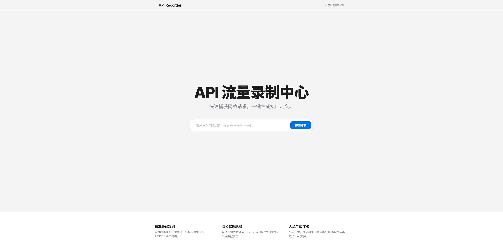

# API Recorder (接口流量录制与调测工具)



这是一款基于 Playwright 的高美学交互式接口录制工具。通过拦截你在浏览器中的自然操作，自动将抓取的业务流量转换为结构化的 **YAML** 和 **Excel API 文档**，并内置了具备高容错性的调测工具。

## 快速开始

1. **安装依赖**：
   ```bash
   pip install -r requirements.txt
   playwright install chromium
   ```

2. **启动录制**：
   ```bash
   python api_recorder.py --module your_module_name
   ```
   > 脚本会自动拉起 Chromium 浏览器，并默认加载本地导航页 (`index.html`)。

3. **交互式指令（终端操作）**：
   - `s` : **Start** 开启抓取
   - `p` : **Pause** 暂停抓取 (页面操作将不再记录)
   - `c` : **Clear** 清空当前已抓取的数据 (用于录制失误时重新开始)
   - `n` : **Normalize** 切换路径归一化开关
   - `b` : **Beautify** 切换 YAML 美化与类型自动转换
   - `t` : **Token** 切换授权信息 (Authorization) 自动脱敏
   - `e` : **Exit** 导出产物并退出

4. **快捷接口调测**：
   ```bash
   python api_executor.py
   ```

## 核心特性

- **多页面全域录制**：[NEW!] 完美支持 `target="_blank"` 或 `window.open` 开启的新标签页/新窗口，流量抓取不中断。
- **ID 自增 Excel 导出**：导出的 Excel 文档逻辑清晰，改用 **ID (1, 2, 3...)** 自增序号，更符合测试用例阅读习惯。
- **域名同步（WAF 绕过）**：执行器自动同步 `Origin` 和 `Referer`，并清理 `sec-` 开头浏览器敏感头部，有效绕过严苛的防火墙校验。
- **归一化路径去重**：同接口不同 ID (`/users/123`, `/users/456`) 自动规约为 `{user_id}` 占位符。
- **高兼容性执行器**：内置对 SSL 警告的静默处理，支持 Body 字段的交互式实时修改。
- **智能过滤**：默认屏蔽资源文件及三方监控请求（如 Google Analytics, Sentry 等），保持录制数据纯净。
- **隐私保护**：自动识别并脱敏敏感请求头，确保导出的文档可安全在团队内部分享。

